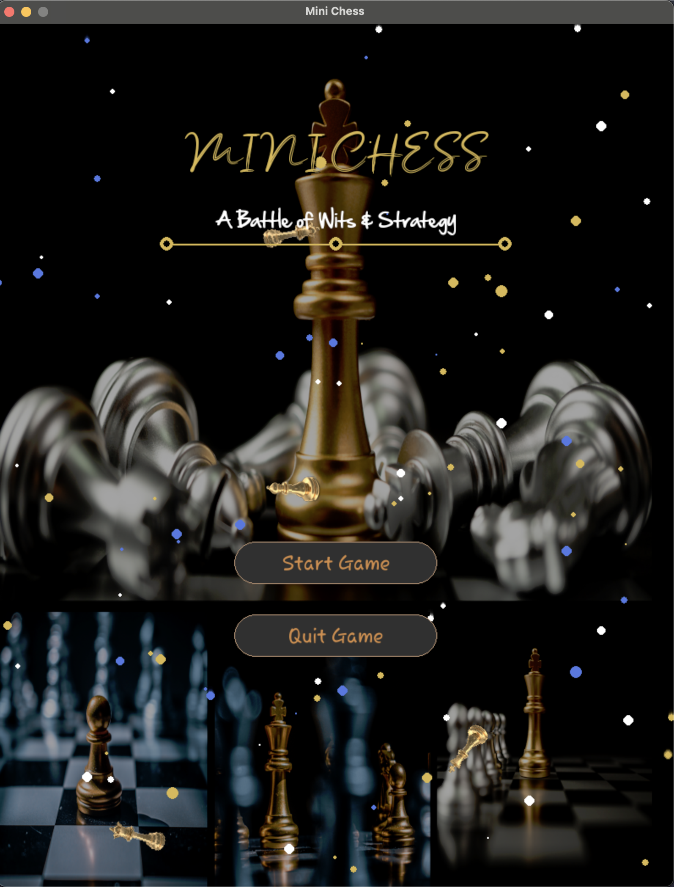
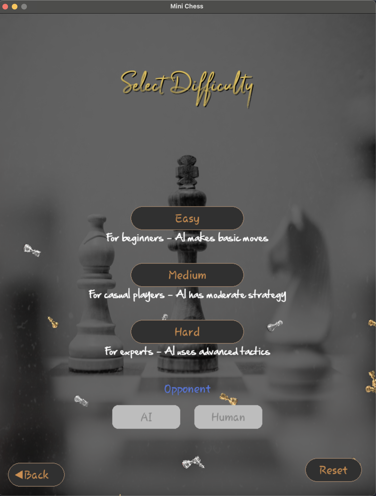
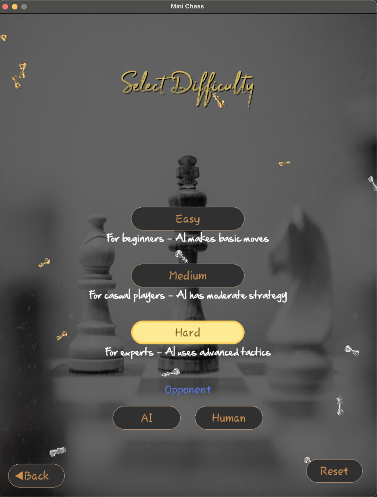
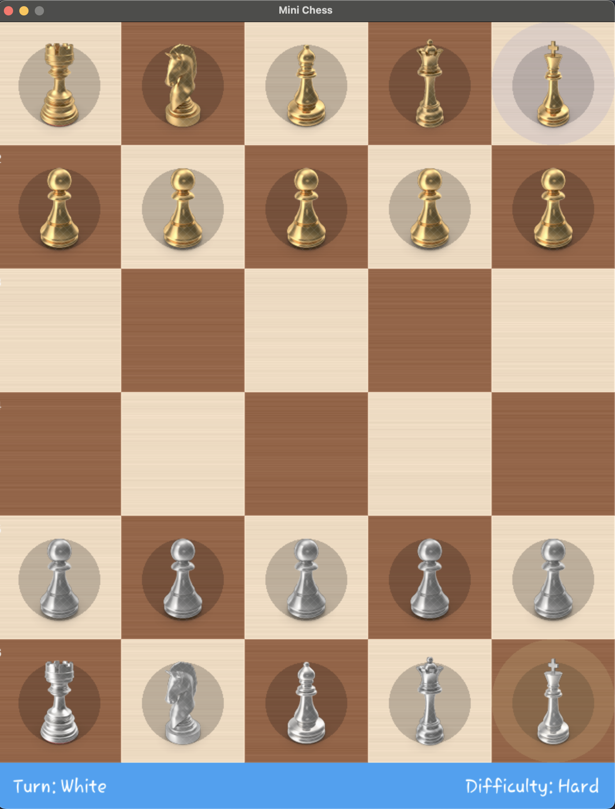
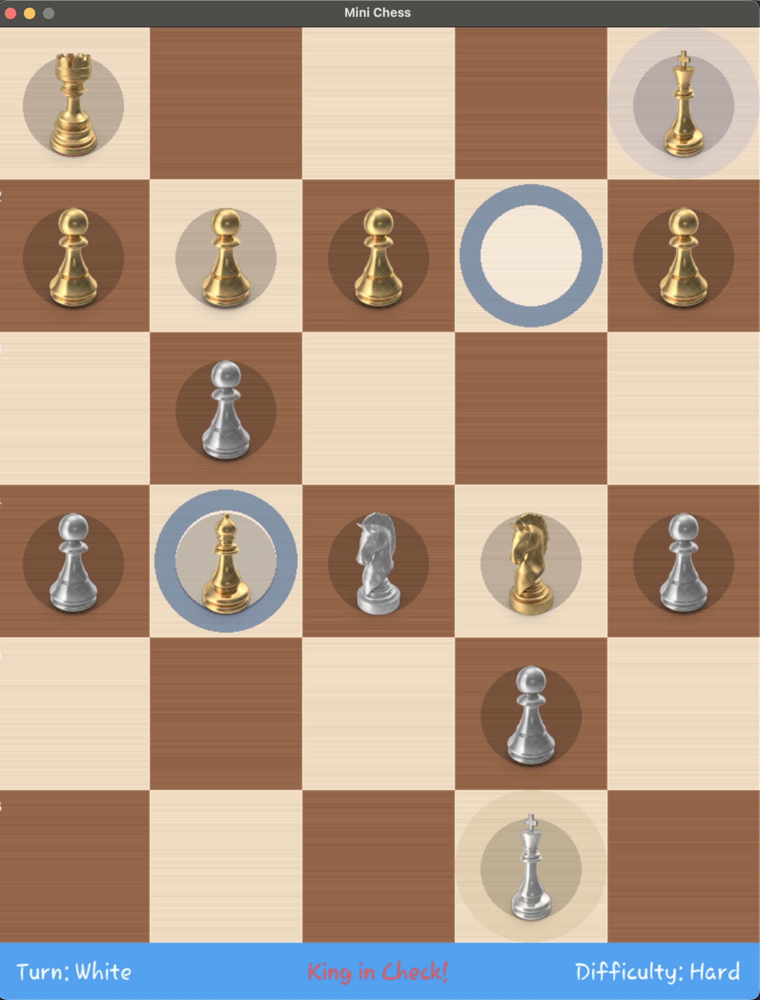
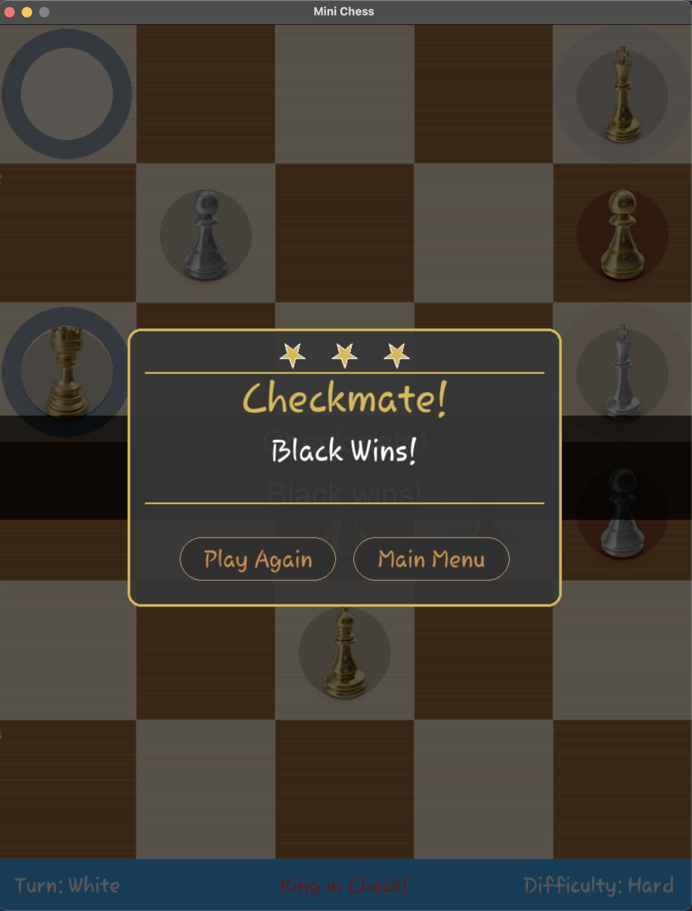

# MiniChess AI Project

**A sophisticated, AI-powered chess implementation featuring advanced algorithms and beautiful visuals**

MiniChess is a high-performance chess game built with Python and Pygame, featuring a robust AI opponent powered by minimax algorithm with alpha-beta pruning. The game offers multiple difficulty levels, stunning visual effects, and comprehensive game mechanics in a compact 5x6 board format.

## 👨‍💻 Development Team

**Team Members**: 
- **Md. Rakibul Islam** - [GitHub Profile](https://github.com/Rakibul1411)
- **Hasnain Sheikh** - [GitHub Profile](https://github.com/Hasnain1408)
- **Md. Kamrul Islam** - [GitHub Profile](https://github.com/141Kamrul)

**Institution**: Institute of Information Technology, University of Dhaka
**Semester**: 6th  
**Course**: CSE-604 - Artificial Intelligence Lab  
**Development Period**: May 2024

---

## Features

### 🧠 **Advanced AI Engine**
- **Minimax Algorithm** with Alpha-Beta Pruning for optimal move selection
- **Dynamic Difficulty Levels**: Easy (Depth 1), Medium (Depth 2), Hard (Depth 3)
- **Adaptive Depth Search**: Increases search depth in endgame scenarios
- **Sophisticated Heuristic Function** with position evaluation and space control analysis
- **Move Ordering Optimization** for improved pruning efficiency

### 🎮 **Game Modes**
- **AI vs Human**: Challenge the computer at different difficulty levels
- **Human vs Human**: Local multiplayer gameplay

### 🖼️ **Modern UI & Visuals**
- **Animated Launch Screen** with floating chess pieces and particle effects
- **Difficulty Selection Screen** with visual difficulty indicators
- **Real-time Move Highlighting** with valid move indicators
- **Check Detection Visual Feedback**
- **Game Over Screens** with win/lose/draw states
- **Professional Wood-textured Board** with coordinate markers

### 🔊 **Audio Experience**
- Ambient background music
- Interactive sound effects (hover, click, move)
- Audio feedback for game events

### 📱 **User Interface**
- Intuitive mouse controls
- Keyboard shortcuts (ESC for menu navigation)
- Responsive button interactions with hover effects
- Clean, modern typography and color schemes


## Project Structure

```
MiniChess_AI-Project-01/
│
├── 📁 assets/                     # Game assets and media files
│   ├── 🎵 ambient.mp3            # Background music
│   ├── 🎵 click.wav              # Click sound effect
│   ├── 🎵 hover.mp3              # Hover sound effect
│   ├── 🎵 game_over.mp3          # Game over music
│   ├── 🖼️ title.png             # Game title image
│   ├── 🖼️ difficulty.png        # Difficulty selection image
│   ├── 🎨 Bassy.ttf              # Game fonts
│   ├── 🎨 handsean.ttf           # 
│   ├── 🎨 Rosemary.ttf           # 
│   └── 🖼️ [piece_images].png    # Chess piece sprites (white/black sets)
│
├── 📁 project-screenshoots/       # Game state screenshots
│   ├── 🖼️ launch-page.png       # Main menu screenshot
│   ├── 🖼️ difficulty-page.png   # Difficulty selection
│   ├── �️ select-difficulty-page.png
│   ├── 🖼️ board-with-pieces.png # Game board view
│   ├── 🖼️ king-check.png        # Check state visualization
│   └── 🖼️ win-screen.png        # Victory screen
│
├── 🐍 main.py                    # Application entry point
├── 🐍 app_logic.py               # Main game loop and state management
├── 🐍 board.py                   # Chess board class with rendering
├── 🐍 pieces.py                  # Piece image loading and management
├── 🐍 ai.py                      # AI engine with minimax algorithm
├── 🐍 app_game_move.py           # Move validation and game rules
├── 🐍 launch_screen.py           # Animated launch screen
├── 🐍 difficulty_screen.py       # Difficulty selection interface
├── 🐍 game_over_ui.py            # End game screen handling
├── 🐍 button_navigation.py       # UI navigation system
├── 🐍 draw_title_button.py       # UI drawing utilities
├── 🐍 color_selection_screen.py  # Player color selection
├── 🐍 constants.py               # Game configuration and constants
├── 📋 requirements.txt           # Python dependencies
├── 📝 plan.txt                   # Development roadmap
└── � README.md                  # Project documentation
```

## Environment Setup & Installation

### Prerequisites
- **Python 3.10+** (Recommended: Python 3.11 or higher)
- **pip** package manager

### Step-by-Step Installation

1. **Clone or Download the Project**
   ```bash
   git clone <repository-url>
   cd MiniChess_AI-Project-01
   ```

2. **Create Virtual Environment** (Recommended)
   ```bash
   # Windows
   python -m venv minichess_env
   minichess_env\Scripts\activate
   
   # macOS/Linux
   python3 -m venv minichess_env
   source minichess_env/bin/activate
   ```

3. **Install Dependencies**
   ```bash
   pip install -r requirements.txt
   # OR
   pip3 install -r requirements.txt
   ```
   
   Or manually install Pygame:
   ```bash
   pip install pygame
   # OR
   pip3 install pygame
   ```

4. **Verify Installation**
   ```bash
   python -c "import pygame; print('Pygame version:', pygame.version.ver)"
   # OR
   python3 -c "import pygame; print('Pygame version:', pygame.version.ver)"
   ```


## How to Run

### Quick Start
```bash
python main.py
# OR
python3 main.py
```

### Gameplay Instructions

1. **Launch the Game**: Run `python main.py` or `python3 main.py`
2. **Main Menu**: Choose "Play" to start or "Quit" to exit
3. **Select Opponent**: Choose between AI or Human opponent
4. **Choose Difficulty**: Select Easy, Medium, or Hard (for AI games)
5. **Play**: 
   - Click on a piece to select it
   - Click on a highlighted square to move

## AI Algorithms & Techniques

### Core Algorithm: **Minimax with Alpha-Beta Pruning**

The AI engine implements a sophisticated decision-making system:

#### **1. Minimax Algorithm**
- **Purpose**: Optimal move selection by evaluating all possible game states
- **Implementation**: Recursive tree search with alternating maximizing/minimizing players
- **Depth Control**: Variable depth based on difficulty setting

```python
def minimax(board, depth, alpha, beta, is_maximizing, player_color, current_color):
    # Base case: terminal node or depth reached
    if depth == 0 or game_state:
        return heuristic_function(board, player_color, opponent_color, game_state)
    
    # Recursive evaluation with pruning
    if is_maximizing:
        # Maximize player's advantage
    else:
        # Minimize opponent's advantage
```

#### **2. Alpha-Beta Pruning**
- **Optimization**: Reduces search space by eliminating redundant branches
- **Performance**: Significantly improves AI response time
- **Statistics Tracking**: Monitors pruning efficiency

#### **3. Advanced Heuristic Evaluation**
The AI evaluates positions using multiple factors:

- **Material Value**: Piece worth assessment
- **Positional Advantage**: Piece placement evaluation
- **Space Control**: Territory domination analysis
- **King Safety**: Check and mate threat assessment
- **Endgame Recognition**: Adaptive strategy in late game

```python
def heuristic_function(board, player_color, opponent_color, game_state):
    # Checkmate/Stalemate detection
    # Material balance calculation  
    # Positional evaluation
    # Space control analysis
    # Winning probability bonus
```

#### **4. Move Ordering Optimization**
- **Purpose**: Improves alpha-beta pruning effectiveness
- **Method**: Evaluates and sorts moves by potential value
- **Result**: Better moves examined first, more cutoffs achieved

#### **5. Adaptive Depth Search**
- **Dynamic Adjustment**: Increases search depth in endgame
- **Piece Count Triggers**: 
  - ≤7 pieces: +2 depth levels
  - ≤11 pieces: +1 depth level
- **Time Management**: 2.5-second move time limit

### **Difficulty Levels**

| Difficulty | Search Depth | Response Time | Playing Strength |
|------------|--------------|---------------|------------------|
| **Easy**   | 1 level      | ~0.1 seconds  | Beginner         |
| **Medium** | 2 levels     | ~0.5 seconds  | Intermediate     |
| **Hard**   | 3 levels     | ~2.0 seconds  | Advanced         |


## Game States & Screenshots

### Launch Screen

*Animated main menu with floating chess pieces and particle effects*

### Difficulty Selection

*Choose your challenge level and opponent type*

### Additional Selection Screen

*Enhanced difficulty selection interface*

### Game Board

*5x6 chess board with professional piece graphics and move highlighting*

### Check Detection

*Visual feedback when the king is in check with red highlighting*

### Victory Screen

*Celebration screen with game outcome and restart options*

---

## Game Mechanics

### **Chess Rules Implementation**
- **Move Validation**: Complete rule enforcement for all piece types
- **Check Detection**: Real-time king safety monitoring
- **Checkmate/Stalemate**: Automatic game end detection
- **Special Moves**: Pawn promotion implemented
- **Turn Management**: Alternating player control

### **Board Features**
- **5x6 Compact Board**: Faster games while maintaining strategy
- **Coordinate System**: Algebraic notation support
- **Visual Highlighting**: Clear move indication and game state feedback
- **Last Move Display**: Track recent moves with color coding


## Technical Implementation

### **Architecture Patterns**
- **Model-View-Controller (MVC)**: Clean separation of game logic and presentation
- **State Management**: Organized screen transitions and game states
- **Event-Driven Programming**: Responsive user interaction handling

### **Performance Optimizations**
- **Efficient Rendering**: Optimized drawing routines for smooth gameplay
- **Memory Management**: Proper resource handling and cleanup
- **Frame Rate Control**: Consistent 120 FPS performance target


## Educational Value

This project demonstrates advanced programming concepts:

### **Artificial Intelligence**
- Game tree search algorithms
- Heuristic evaluation functions
- Alpha-beta pruning optimization
- Adaptive depth strategies

### **Game Development**
- 2D graphics programming with Pygame
- Event-driven architecture
- State management systems
- Audio integration

## 📝 License

This project is open source and available under the [MIT License](LICENSE).

---

*`Built with using Python and Pygame`*
